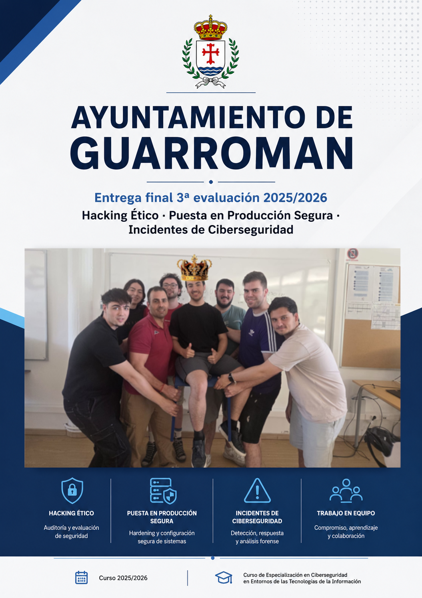
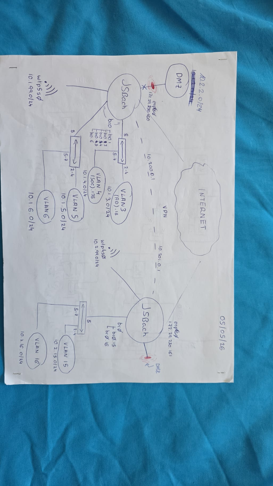

# 🏛️ munisec: Infraestructura Municipal Segura

 

**munisec** es un proyecto integral de ciberseguridad que simula la infraestructura IT completa de un ayuntamiento ficticio: **el ayuntamiento de Guarroman**.

Fue desarrollado por un equipo de especialistas durante tres meses, y el proyecto abarca desde el diseño y despliegue de redes hasta la implementación de un SOC, ejecución de operaciones de Red Team, bastionado profundo, análisis forense y la aplicación de la normativa correspondiente como el ENS, RGPD, AEPD, etc.

  

## 📌 Origen del proyecto
El objetivo del proyecto era el siguiente: nos dividimos en 2 grupos ficticios, el equipo de **[Guarroman](https://github.com/joliher/munisec)** y el equipo de **[Benimerda](https://pablogonzalez-personalweb.lovable.app/proyectos/benimerda)**.

El proyecto se estructuró como un laboratorio realista donde en cada equipo se desplegarían dos sedes conectadas por VPN: el Ayuntamiento (Ayto) y la Casa de la Cultura (CC).

Se planificaron e implementaron las infraestructuras de red correspondiente a cada equipo y, una vez nos aseguramos de que ambos equipos estábamos preparados, procedimos a someter la infraestructura del equipo rival a pruebas de intrusión severas para poder practicar y aprender sobre habilidades de Red Team en un entorno lo más cercano a la realidad posible.

Además, ambos equipos tuvimos que enfrentarnos a incidentes reales de desastre físico (como una tormenta eléctrica) que forzaron la ejecución de *planes de recuperación ante desastres*.

El objetivo final fue diseñar, comprometer, recuperar y securizar completamente una red institucional, aplicando la normativa correspondiente.

## 🏗️ Arquitectura de Red

El proyecto simuló una infraestructura corporativa real distribuida en dos ubicaciones geográficas físicas:
- **Ayuntamiento (Sede Principal):** Aloja los servicios críticos como el Active Directory, ERP, el SOC (SIEM/IDS) y redes de trabajo internas.
- **Casa de la Cultura (Sede Secundaria):** Actúa como delegación periférica, con redes de acceso público y equipos de consulta.

Ambas sedes fueron interconectadas mediante túneles **VPN (WireGuard)** para garantizar el enrutamiento seguro y simular escenarios de teletrabajo. Durante la simulación, la infraestructura sufrió un "desastre eléctrico" que obligó al equipo a ejecutar protocolos de contingencia y rediseñar la topología de redención en vivo, migrando de pfSense a routers Linux (JSBach).

👉 **[Ver topología completa, subredes, VLANs y configuración técnica](./docs/00-network-architecture.md)**

## 📂 Estructura del Repositorio
Toda la documentación técnica se encuentra en la carpeta [`/docs`](./docs/).

### 🌐 Infraestructura y SOC
- [00. Arquitectura de Red](./docs/00-network-architecture.md) - Topología en detalle, VLANs, y routers (JSBach).
- [01. Infraestructura y Servicios](./docs/01-infrastructure.md) - Active Directory, Odoo, DMZ.
- [02. SOC, SIEM y Monitorización](./docs/02-soc-siem.md) - Wazuh, Suricata, Syslog, Bot de Telegram e integración VirusTotal.

### 🛡️ Defensa y Forense
- [03. Bastionado (Hardening)](./docs/03-hardening.md) - Aseguramiento de servidores, WAF, GPOs, 2FA, iptables y cifrado.
- [05. Forense Digital (DFIR)](./docs/05-dfir-forensics.md) - Adquisición de memoria RAM, análisis Volatility y respuesta ante incidentes.
- [06. Normativa y Cumplimiento](./docs/06-compliance.md) - Adecuación al ENS, RGPD, notificaciones AEPD y auditorías SCA.

### ⚔️ Operaciones Ofensivas y Registro
- [04. Red Team y Pentesting](./docs/04-red-team-pentesting.md) - OSINT, cadena de ataque completa (Attack Chain) y matriz de hallazgos.
- [07. Cronología de Operaciones](./docs/07-project-timeline.md) - Bitácora e hitos del proyecto.

## 👥 El Equipo
Este proyecto fue desarrollado por un grupo de 8 técnicos de ciberseguridad. Para consultar la aportación detallada de cada integrante a la infraestructura, pentesting, desarrollo de scripts y documentación, consulta:

👉 **[Contribuyentes y Asignación de Roles](./CONTRIBUTORS.md)**

## 📅 Timeline del Proyecto
- **Marzo 2026**: Planificación y despliegue de red, instalación de servidores Windows Server 2016 y Ubuntu 22.04 (JSBach), creación del AD y configuración inicial de OUs y endpoints.
- **Abril 2026**: Despliegue inicial de firewalls de frontera (pfSense) y túneles VPN. Instalación del SOC (Wazuh, Suricata y VirusTotal) y aplicación de GPOs en el AD. Se aplicó bastionado de tráfico inter-VLAN, 2FA en los servidores críticos e implementación de monitorización de logs. Gestión del incidente de DR por tormenta eléctrica e inicio de la recopilación OSINT.
- **Mayo 2026**: Finalización fase OSINT, ejecución de ataques dirigidos (Red Team), bastionado intensivo, desarrollo forense automatizado y generación de documentación legal simulada.

---
*Este proyecto fue desarrollado íntegramente en un entorno de laboratorio controlado para fines académicos y educativos.*
