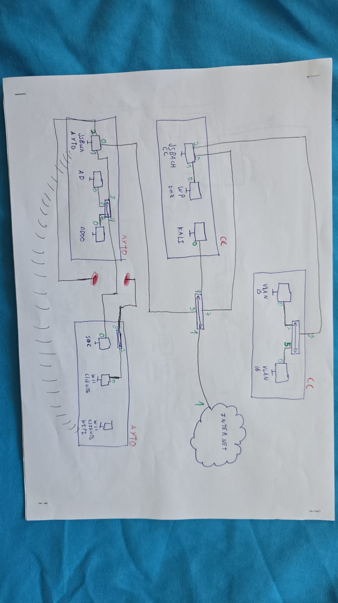

# 00. Arquitectura de Red y Topología

> 👉 Para consultar el desglose exacto de tareas técnicas realizadas por cada miembro, revisa el **[Registro de Contribuyentes](../CONTRIBUTORS.md)**.<br>
> **Periodo**: Marzo 2026 - Mayo 2026

## Descripción General

La arquitectura de red del proyecto está diseñada para dar servicio a una infraestructura gubernamental municipal distribuida en dos sedes físicas principales: la **Sede Principal (Ayuntamiento)** y la **Sede Secundaria (Casa de la Cultura)**.

El enrutamiento, la segmentación por VLANs, la gestión DHCP, el portal cautivo y la terminación de los túneles VPN se centralizan en enrutadores dedicados basados en Linux denominados **[JSBach](../software/jsbach/)**.

---

## 📐 Topología Lógica de Red


*(Esquema de la topología lógica global de la infraestructura)*

La red se estructura en dos grandes bloques de direccionamiento privado (`10.1.0.0/16` para el Ayuntamiento y `10.2.0.0/16` para la Casa de la Cultura), interconectados de forma permanente mediante un túnel seguro **WireGuard Site-to-Site** (`10.200.0.0/30`) establecido entre los dos routers JSBach.

Adicionalmente, la infraestructura cuenta con un túnel VPN dedicado (`10.201.0.0/24`) para accesos remotos y teletrabajo.

---

## 🔌 Topología Física y Despliegue de Hardware


*(Esquema de la interconexión física de equipos, switches y routers)*

La infraestructura física está compuesta por:
* **Enrutadores Core / Frontera**: Servidores Linux dedicados ejecutando el software de enrutamiento y cortafuegos `JSBach`.
* **Conmutación**: Switches gestionables TP-Link SG2210MP interconectados por enlaces *trunk* etiquetados con 802.1Q.
* **Servidores y Endpoints**: Servidores Windows Server 2016 y Ubuntu Server, junto a estaciones cliente Windows 10 unidas al dominio `guarroman.local`.

---

## 🏢 Segmentación y VLANs por Sede

### 🏛️ Sede Principal: Ayuntamiento (`10.1.0.0/16`)

El enrutador **JSBach** gestiona el direccionamiento interno y la distribución de tráfico mediante conmutadores gestionables TP-Link hacia las distintas VLANs corporativas:

| VLAN | Subred | Propósito | Servicios / Equipos Críticos |
|------|--------|-----------|-----------------------------|
| **VLAN 1** | `10.1.1.0/24` | **Administración** | Gestión de red, switches, acceso privilegiado |
| **VLAN 3** | `10.1.3.0/24` | **Servidores Internos** | Active Directory (`guarroman.local`), Servidor Odoo (ERP) |
| **VLAN 4** | `10.1.4.0/24` | **SOC / Seguridad** | Servidor Wazuh Manager (`10.1.4.138`), Suricata NIDS |
| **VLAN 5** | `10.1.5.0/24` | **Oficinas / Trabajo** | Endpoints de funcionarios |
| **VLAN 6** | `10.1.6.0/24` | **Oficinas / Trabajo** | Endpoints de funcionarios |
| **WiFi** | `10.1.99.0/24` | **Wi-Fi Trabajadores** | Red inalámbrica para empleados con autenticación |

---

### 📚 Sede Secundaria: Casa de la Cultura (`10.2.0.0/16`)

La sede secundaria alberga los servicios web públicos expuestos y la red de acceso ciudadano para la biblioteca pública:

| VLAN | Subred | Propósito | Servicios / Equipos Críticos |
|------|--------|-----------|-----------------------------|
| **VLAN 1** | `10.2.1.0/24` | **Administración** | Gestión de switches locales |
| **VLAN 2** | `10.2.2.0/24` | **DMZ / Sistemas** | Servidor Web Apache / WordPress, phpMyAdmin expuesto |
| **VLAN 15**| `10.2.15.0/24`| **Biblioteca (Pública)** | Ordenadores de consulta pública |
| **VLAN 16**| `10.2.16.0/24`| **Biblioteca (Pública)** | Ordenadores de consulta pública |
| **WiFi** | `10.2.99.0/24` | **Wi-Fi Cultura** | Acceso inalámbrico público restringido por Portal Cautivo |

> **Control de Acceso Inalámbrico**: Las redes Wi-Fi restringen el acceso mediante un **Portal Cautivo** integrado en Apache, obligando a los usuarios a identificarse antes de otorgar acceso a Internet o recursos de red.

---

## ⚡ Evolución Arquitectónica y Contingencia (DRP)

Durante las primeras etapas del proyecto, el perímetro exterior estaba resguardado por cortafuegos dedicados **pfSense** (con IPs públicas `172.29.230.160` y `.161`), sobre los cuales se levantaban los primeros túneles VPN inter-sedes.

Sin embargo, a principios de mayo ocurrió un **incidente por fallo eléctrico masivo (sobretensión)** que inutilizó los equipos pfSense de frontera. Ante esta emergencia, el equipo aplicó un plan de recuperación (DRP):

1. **Reestructuración a JSBach**: Se eliminó la capa de pfSense y se promovió el router Linux propio **JSBach** como enrutador de frontera y firewall principal.
2. **Migración de Túneles VPN**: Se ejecutaron las rutinas del script `backupJSBach.sh` para reconfigurar la interfaz WireGuard (`wg0`) directamente sobre los JSBach de ambas sedes.
3. **Enrutamiento entre Sedes**: Se restauró la comunicación inter-sedes mediante las siguientes rutas permanentes:

```bash
# Enrutamiento inter-sedes restaurado en la interfaz WireGuard (wg0)
sudo ip route add 10.2.0.0/16 via 10.200.0.2 dev wg0 # Configuración en Ayto
sudo ip route add 10.1.0.0/16 via 10.200.0.1 dev wg0 # Configuración en Casa Cultura
```


