# 04. Operaciones Red Team y Auditoría Ofensiva (Pentesting)

> 👉 Para consultar el desglose exacto de tareas técnicas realizadas por cada miembro, revisa el **[Registro de Contribuyentes](../CONTRIBUTORS.md)**.<br>
> **Periodo**: Abril 2026 - Mayo 2026

---

## 📄 Descripción General

El equipo de Red Team ejecutó una auditoría de seguridad ofensiva completa simulando la perspectiva de un atacante externo avanzado. El ejercicio se desarrolló en tres grandes fases, determinadas por la disponibilidad de los servicios del equipo rival:

1. **Fase OSINT y Reconocimiento Inicial de Benimerda**: Obtención de credenciales de correo electrónico del equipo rival e inspección de su infraestructura de red. Se logró acceso al panel de administración del router JSBach de Benimerda mediante credenciales por defecto, lo que permitió mapear su topología interna (VLANs, DHCP, WiFi, servicios SOC, Active Directory y ERP). Sin embargo, **la DMZ web de Benimerda aún no estaba desplegada**, por lo que no era posible continuar la cadena de ataque sobre su portal web.
2. **Auditoría Ofensiva sobre Guarromán (Auto-ataque)**: Ante la imposibilidad de pivotar sobre la DMZ rival, el equipo decidió aplicar las técnicas de pentesting **contra su propia infraestructura** (Guarromán) como ejercicio de auditoría interna. Se comprometió la DMZ propia a través de phpMyAdmin, se inyectó una Reverse Shell vía WordPress y se logró la escalada de privilegios hasta obtener acceso `root` en el router core JSBach de Guarromán.
3. **Campaña Ofensiva Final sobre Benimerda**: Una vez que la DMZ del rival estuvo operativa, se replicaron las mismas técnicas de Red Team contra el portal WordPress de Benimerda, logrando acceso administrativo e inyección de código remoto con éxito total.

---

## 🔎 1. Inteligencia de Fuentes Abiertas (OSINT)

* **Investigadores**: Trabajo conjunto de los 8 miembros del equipo (Jose Luis Oliver, Carlos Delgado, Pau Roig, Jorge Cortés, Enrique Cebrián, Luis Fuster, Marcos Bori y Alfonso Garrido).
* **Objetivos**: Mapeo de la superficie expuesta y recopilación de huella digital técnica y organizativa del entorno rival (Ayuntamiento de Benimerda).

<br>

### 👥 Asignación de Perfiles Ficticios

Para simular un entorno corporativo realista sujeto a ataques de *spear-phishing* o ingeniería social, se asignaron identidades ficticias vinculadas a direcciones de correo del laboratorio:

| Cargo | Identidad Ficticia | Integrante Asignado |
| :--- | :--- | :--- |
| **Alcalde** | Baltasar Cañete Huertas | Carlos Delgado |
| **Concejala** | Rocío Mesa Jiménez | Pau Roig |
| **Biblioteca** | Dolores Expósito | Enrique Cebrián |
| **Representante Casa Cultura** | Fermín Valverde | Alfonso Garrido |
| **Funcionario / Informático** | Isidoro Quesada | Jose Luis Oliver |
| **Otros Funcionarios** | Trinidad Molina / Cristóbal Lorite / Valvanera Pinilla | Luis Fuster / Jorge Cortés / Marcos Bori |

<br>

### 🛠️ Vías de Reconocimiento y Auditoría Defensiva

- **Enumeración de Dominios e IPs**: Identificación de rangos de direccionamiento público y puntos de entrada expuestos.
- **Filtro de Credenciales Filtradas**: Búsqueda pasiva en bases de datos de brechas de terceros (ej. *HaveIBeenPwned*), identificando patrones de contraseñas débiles reutilizadas por perfiles administrativos.
- **Autoprotección (Blue OSINT)**: Carlos Delgado auditó los correos del Ayuntamiento de Guarromán para mitigar la enumeración de usuarios en el CMS WordPress y solicitar el borrado de huellas en plataformas de acceso público.

<br>

### 🏆 Compromiso Total de Credenciales (Mediante Filtración de IA)

A través de las investigaciones de OSINT, entre el 4 y el 9 de mayo, el equipo logró vulnerar de forma secuencial las cuentas del ayuntamiento rival (Benimerda):

1. **4 de mayo**: Se obtuvo la contraseña de la Concejala de Benimerda mediante técnicas OSINT directas.
2. **5 de mayo (Hallazgo Clave)**: Se consiguieron las credenciales de *Funcionario 2* (fuerza bruta con diccionario personalizado) y *Funcionario 5*. Al acceder a una de estas cuentas, se descubrió un **correo electrónico reenviado desde una cuenta personal** que contenía una tabla con contraseñas "prototipo" o parciales de todos los miembros del equipo.
3. **5 al 9 de mayo (Compromiso Crítico)**: Gracias a los patrones descubiertos en el correo filtrado, se logró deducir y vulnerar la contraseña de la cuenta del **Alcalde de Benimerda**. Al investigar su historial, se descubrió una conversación filtrada con la inteligencia artificial *Gemini*, donde el Alcalde había expuesto **las contraseñas definitivas en texto plano de absolutamente todo su equipo**.

Este hallazgo permitió la recolección total de las credenciales del equipo contrario, demostrando dos riesgos críticos: el reenvío de credenciales a cuentas personales y la fuga de datos (*Data Leak*) en plataformas de IA generativa.

<br>

**Evidencias de la filtración:**

> 📌 *Captura 1: Correo interceptado con contraseñas "prototipo" reenviado desde cuenta personal.*

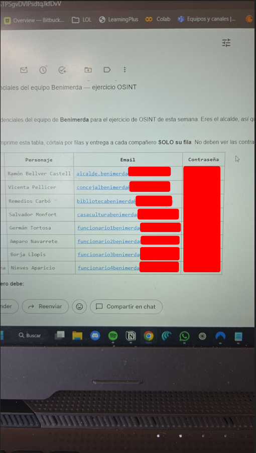

<br>

> 📌 *Captura 2: Tabla completa con todas las credenciales definitivas del equipo rival, obtenida del historial de Gemini.*


<br>

> 📌 *Captura 3: Historial de la conversación en Gemini dentro de la cuenta del Alcalde de Benimerda, donde se expusieron las contraseñas en texto plano.*

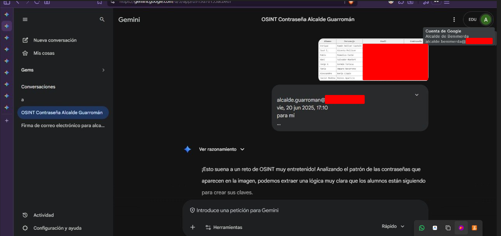

<br>

> 📌 *Captura 4: Sesiones de correo vulneradas demostrando acceso simultáneo a todas las cuentas del equipo de Benimerda.*


---

## ⚔️ 2. Reconocimiento Técnico e Intrusión en la Red de Benimerda

Con las credenciales OSINT en mano, el equipo inició el reconocimiento técnico directo sobre la infraestructura del Ayuntamiento de Benimerda.

### 📡 2.1 Descubrimiento de Red y Acceso al Router Perimetral

El primer paso consistió en identificar los hosts activos en el segmento de red del laboratorio mediante `netdiscover` y escaneos dirigidos con `nmap`.

Al detectar la interfaz web del router JSBach de Benimerda (`172.29.230.171`), se intentó el acceso con las **credenciales por defecto de fábrica** (`admin / admin`). El panel respondió concediendo acceso administrativo completo, lo que constituyó el **Hallazgo H7** (credenciales por defecto no modificadas).

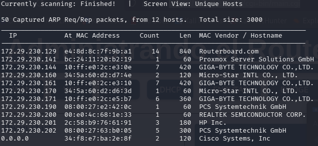
*(Captura 01: Descubrimiento de hosts activos en el direccionamiento del laboratorio mediante Netdiscover)*

<br>


*(Captura 02: Escaneo de puertos Nmap contra el router perimetral de Benimerda 172.29.230.171, revelando HTTP y HTTPS abiertos)*

<br>


*(Captura 03: Interfaz web de autenticación del router JSBach de Benimerda ("Login - LosChichos") en 172.29.230.171)*

<br>

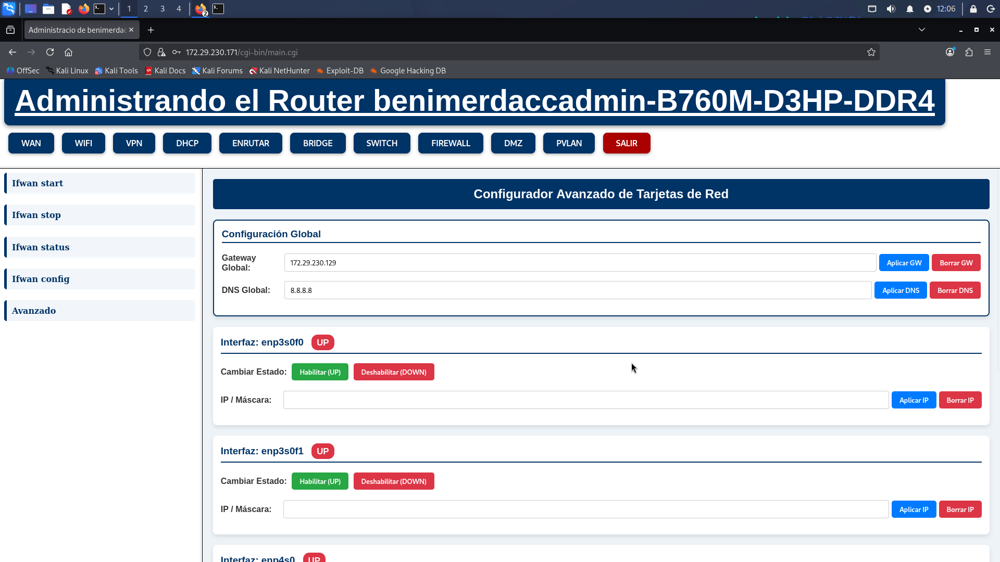
*(Captura 04: Acceso administrativo concedido al router de Benimerda ("benimerdaccadmin") con credenciales por defecto)*

<br>

### 🗺️ 2.2 Mapeo de la Topología Interna de Benimerda

Una vez dentro del panel de administración del router, el equipo inspeccionó la configuración completa de red del rival: VLANs, rangos DHCP, configuración WiFi y tablas de enrutamiento.

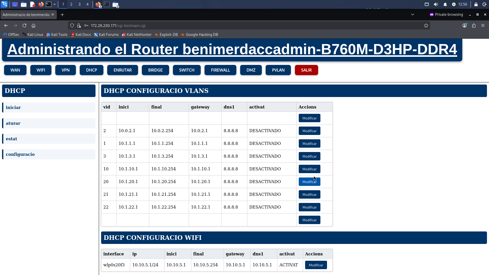
*(Captura 05: Configuración DHCP y VLANs del router de Benimerda)*

<br>


*(Captura 06: Configuración WiFi del Ayuntamiento de Benimerda: SSID "Cateto", WPA-PSK con passphrase débil)*

<br>


*(Captura 07: Adición de rutas estáticas en la máquina atacante para alcanzar las VLANs internas de Benimerda)*

<br>


*(Captura 08: Topología de VLANs del segundo router de Benimerda ("benimerdaadmin", 172.29.230.170): Admin, DMZ, SOC, WIFI, AdminG, Backups)*

<br>

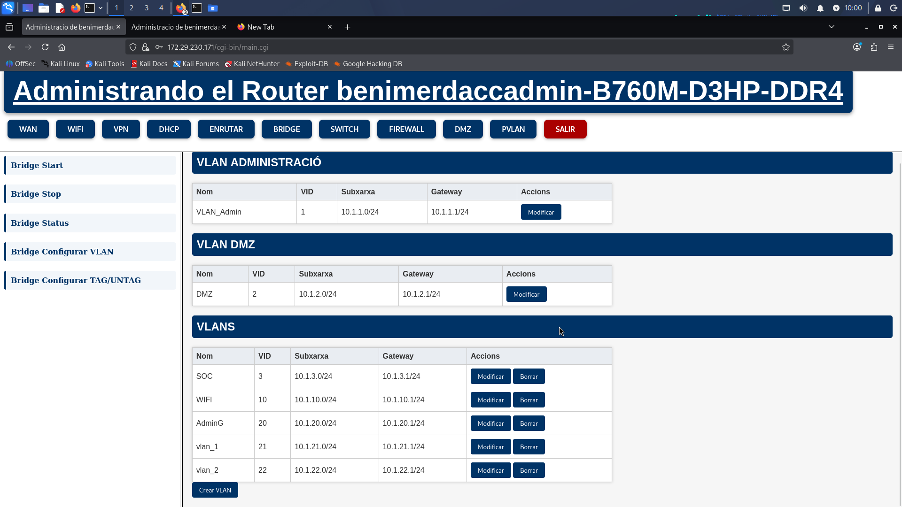
*(Captura 09: Topología de VLANs en el router principal de Benimerda ("benimerdaccadmin", 172.29.230.171))*

<br>

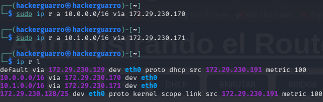
*(Captura 10: Tabla de rutas configurada en la máquina atacante, alcanzando ambas subredes internas de Benimerda (10.0.0.0/16 y 10.1.0.0/16))*

---

### 🔍 2.3 Enumeración de Servicios Internos de Benimerda

Con visibilidad sobre las VLANs internas del rival, se realizaron escaneos dirigidos a sus servicios críticos: **SOC (Wazuh + Zabbix)**, **Active Directory** y **ERP Odoo**.


*(Captura 11: Escaneo Nmap sobre la VLAN del SOC de Benimerda (10.0.3.0/24), revelando dos hosts con servicios web)*

<br>


*(Captura 12: Interfaz de login de Wazuh Dashboard localizada en el SOC de Benimerda (10.0.3.2))*

<br>


*(Captura 13: Identificación de la versión del servidor web Apache 2.4.58 en el SOC de Benimerda)*

<br>


*(Captura 14: Escaneo de la VLAN AdminG de Benimerda (10.0.20.0/24), descubriendo el servidor Active Directory)*

<br>

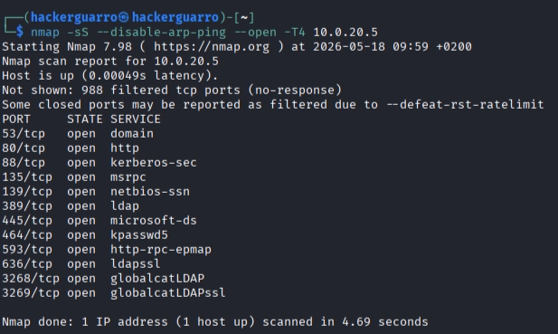
*(Captura 15: Enumeración detallada del Active Directory de Benimerda (10.0.20.5): servicios DNS, Kerberos, LDAP, SMB y MSRPC abiertos)*

<br>


*(Captura 16: Acceso al ERP Odoo de Benimerda (10.0.20.5:8069) con las credenciales OSINT, revelando el directorio completo de empleados ficticios)*

---

### 📊 2.4 Compromiso del Panel de Monitorización Zabbix de Benimerda (Hallazgo H1)

El rastreo de directorios con `Gobuster` sobre el servidor del SOC reveló una ruta `/zabbix`. Al acceder al formulario de login, se comprobaron las credenciales por defecto del fabricante (`Admin / zabbix`), las cuales no habían sido modificadas. Esto otorgó acceso administrativo completo al dashboard de monitorización del rival.

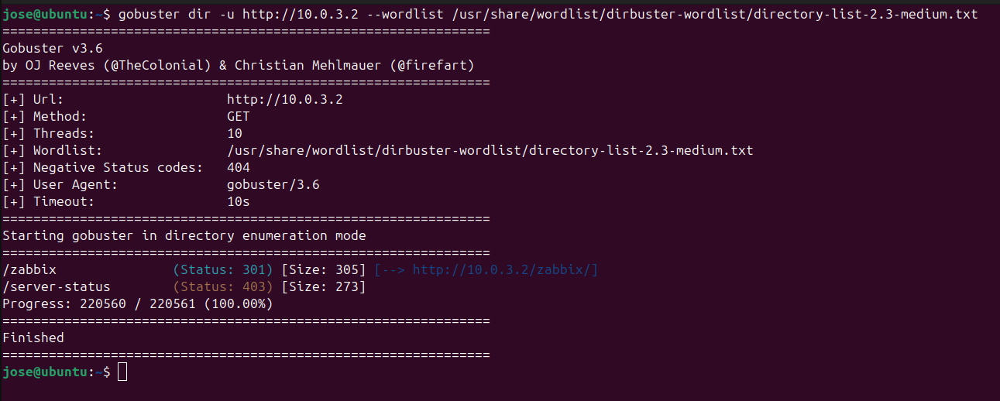
*(Captura 17: Fuzzing de directorios con Gobuster sobre el SOC de Benimerda (10.0.3.2), detectando la ruta /zabbix)*

<br>

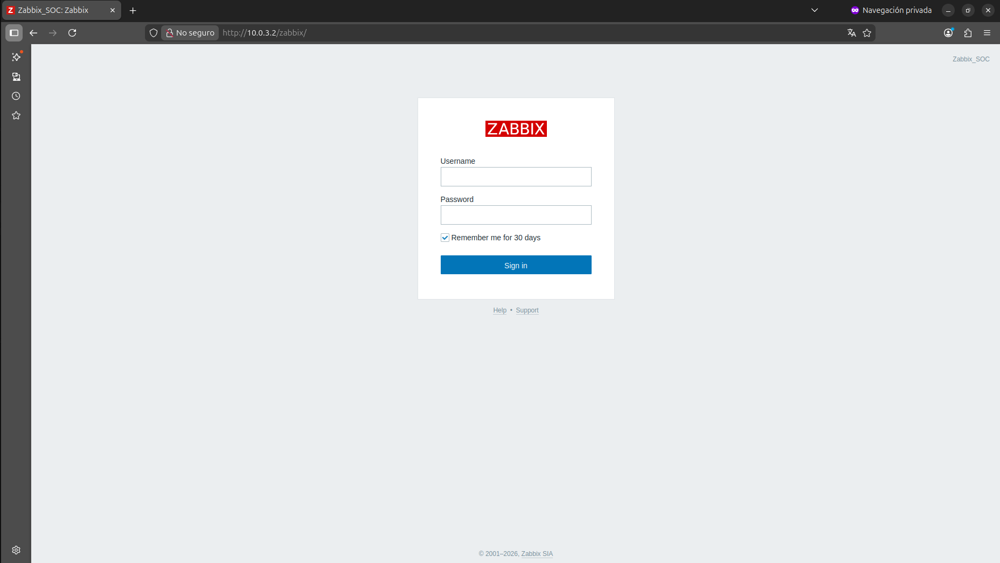
*(Captura 18: Formulario de inicio de sesión en el panel Zabbix de Benimerda ("Zabbix_SOC"))*

<br>


*(Captura 19: Búsqueda de las credenciales por defecto de Zabbix para verificar si habían sido cambiadas)*

<br>

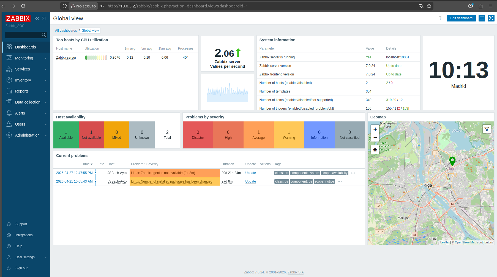
*(Captura 20: Panel principal de Zabbix del rival accedido con privilegios de superusuario. Se observa la monitorización del host "JSBach-Ayto" de Benimerda)*

---

### 🚧 2.5 Bloqueo: DMZ de Benimerda No Operativa

En este punto, el equipo había logrado:
- ✅ Acceso total al router JSBach de Benimerda (credenciales por defecto).
- ✅ Mapeo completo de su topología interna (VLANs, DHCP, WiFi).
- ✅ Acceso al SOC (Zabbix con credenciales por defecto).
- ✅ Acceso al Active Directory y al ERP Odoo con credenciales OSINT.

Sin embargo, **la DMZ web del Ayuntamiento de Benimerda aún no estaba desplegada**, por lo que no era posible atacar su portal WordPress ni pivotar desde un servidor comprometido hacia la red interna.

Ante esta situación, el equipo decidió **redirigir el ataque contra su propia infraestructura (Guarromán)** para validar las técnicas ofensivas y demostrar el impacto potencial de las vulnerabilidades.

---

## 🎯 3. Auditoría Ofensiva sobre la Propia Infraestructura (Guarromán)

### 🌐 3.1 Reconocimiento del Servidor Web de Guarromán (DMZ)

El servidor web del Ayuntamiento de Guarromán (`172.29.230.161`) fue analizado mediante escaneos Nmap de versiones y scripts. Se detectó Apache HTTP Server ejecutando WordPress 4.7.33, phpMyAdmin expuesto y la Forensic Scripts Suite en el puerto 5001.


*(Captura 21: Escaneo Nmap del servidor web propio 172.29.230.161, revelando puertos 80, 443 y 5001 abiertos)*

<br>

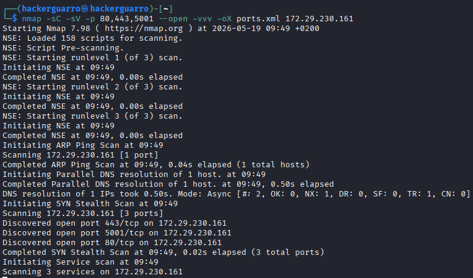
*(Captura 22: Escaneo detallado de versiones y scripts sobre el servidor de la DMZ de Guarromán)*

<br>


*(Captura 23: Informe Nmap formateado revelando WordPress 4.7.33, Apache 2.4.58 y la Forensic Scripts Suite en el servidor de Guarromán)*

<br>


*(Captura 24: Portal institucional público del Ayuntamiento de Guarromán ("AYTO_GUARROMAN"))*

---

### 🔓 3.2 Acceso Inicial mediante phpMyAdmin (Hallazgos H2 y H3)

La cadena de explotación sobre la DMZ de Guarromán siguió esta secuencia:

```
[ phpMyAdmin Expuesto ] ➔ [ Fuerza Bruta: root / alumno ] ➔ [ Lectura wp_users / wp_pass ]
                                                                             │
[ ROOT JSBACH (Control Total) ] ◄─ [ Escalada Sudoers ] ◄─ [ Acceso Remoto RCE ] ◄─┘
```

<br>

1. **Exposición Pública**: La interfaz `/phpmyadmin` se encontraba expuesta sin restricciones por IP.
2. **Fuerza Bruta**: Se obtuvieron las credenciales del superusuario MySQL (`root` / `alumno`).
3. **Fuga de Credenciales**: Se localizó la tabla señuelo `wp_pass` con las contraseñas de los funcionarios en texto plano.


*(Captura 25: Formulario de inicio de sesión en phpMyAdmin expuesto en la DMZ de Guarromán)*

<br>


*(Captura 26: Inspección de la tabla de usuarios de WordPress en la base de datos MySQL)*

<br>

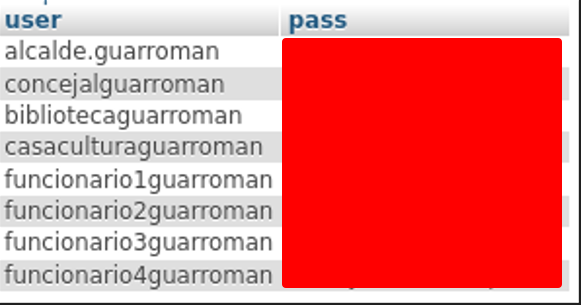
*(Captura 27: Tabla de respaldo wp_pass exponiendo contraseñas de usuarios sin cifrar)*

---

### 💻 3.3 Escalada a WordPress e Inyección RCE (Hallazgo H4)

1. **Acceso al Panel Web**: Con las claves recuperadas (`funcionario1guarroman`), el equipo inició sesión en `/wp-admin`.
2. **Subida de Plugin Malicioso**: Se instaló el plugin **File Manager**, el cual permitió editar archivos del servidor e inyectar el código PHP de una *Reverse Shell* dentro de `index.php`.

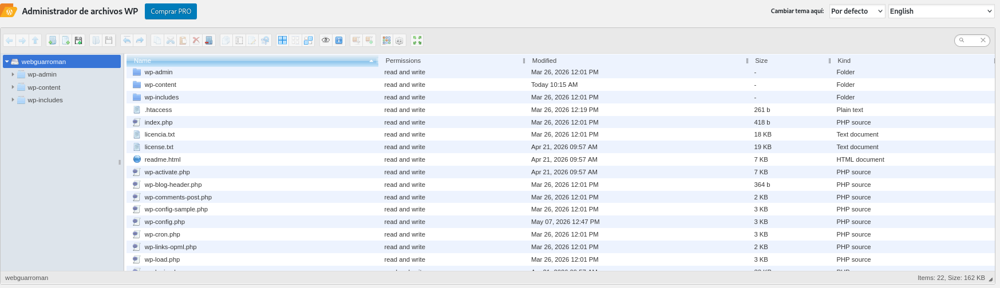
*(Captura 28: Administración de WordPress de Guarromán con el plugin File Manager habilitado)*

<br>

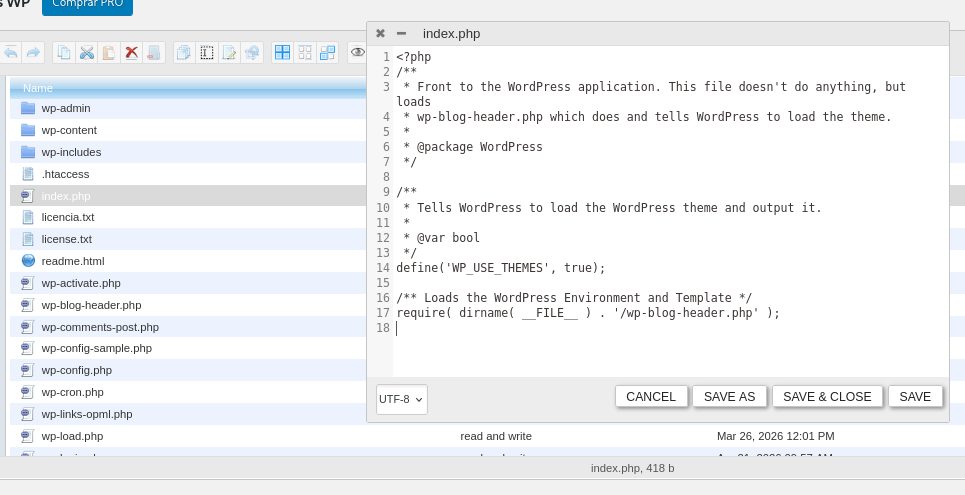
*(Captura 29: Inyección del script de acceso remoto en PHP dentro de index.php)*

---

### 🐚 3.4 Ejecución de Código Remoto (RCE) y Estabilización TTY

1. **Conexión Entrante**: Se puso a la escucha un listener de Netcat (`nc -lvnp 1234`), recibiendo la consola remota como usuario de servicio `daemon`.
2. **Estabilización de Consola**: Se ejecutó `python3 -c 'import pty; pty.spawn("/bin/bash")'` para obtener una consola TTY interactiva.


*(Captura 30: Listener de Netcat recibiendo la conexión entrante de la Reverse Shell)*

<br>


*(Captura 31: Consola inicial obtenida en el servidor de Guarromán)*

<br>


*(Captura 32: Comprobación de la disponibilidad de Python3 en el sistema)*

<br>

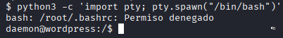
*(Captura 33: Ejecución de la rutina pty en Python para promover la shell)*

<br>

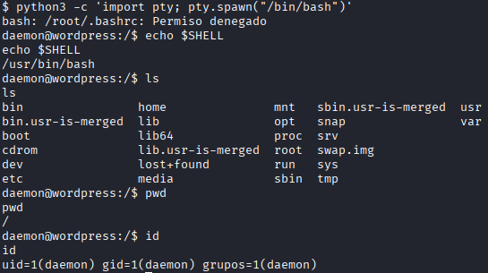
*(Captura 34: Consola interactiva TTY /bin/bash lista para la ejecución de comandos)*

---

### 🕵️ 3.5 Enumeración Local y Auditoría del Sistema

1. **Búsqueda de Vías de Elevación**: Se ejecutó el script `linPEAS` para analizar permisos y configuraciones locales.
2. **Lectura de Cuentas**: Se inspeccionó `/etc/passwd` confirmando la existencia del usuario local `funcionario1guarroman`.

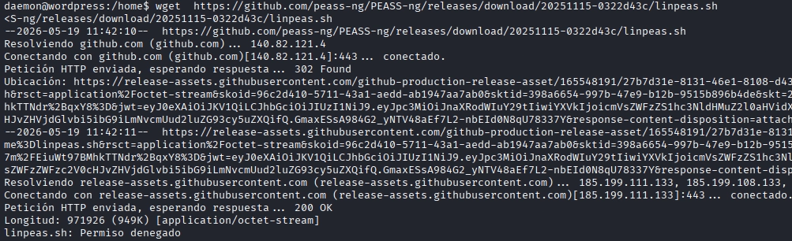
*(Captura 35: Script de auditoría linPEAS buscando vulnerabilidades en la configuración local)*

<br>

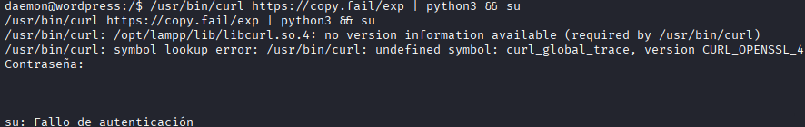
*(Captura 36: Evaluación de la vulnerabilidad CopyFail en la versión de kernel)*

<br>


*(Captura 37: Contenido del archivo /etc/passwd revelando los usuarios del sistema)*

---

### 👑 3.6 Escalada de Privilegios a Root (Hallazgos H5, H6)

1. **Reutilización de Credenciales**: Mediante `su - funcionario1guarroman`, se cambió de usuario utilizando la clave recuperada en la fase web.
2. **Escalada por Sudoers**: Al verificar las reglas de `sudo`, se descubrió la directiva permisiva `ALL=(ALL) NOPASSWD: ALL`. Ejecutando `sudo su`, se obtuvo inmediatamente una consola con privilegios de **`root`** en el router core JSBach de Guarromán.

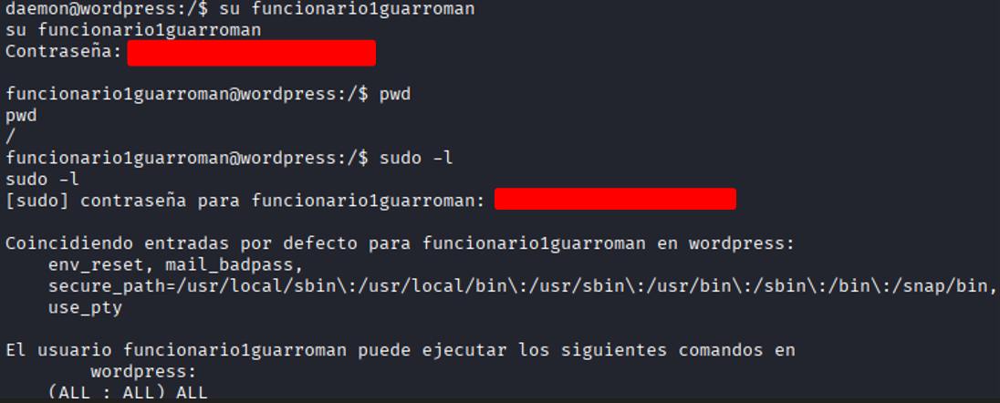
*(Captura 38: Cambio de usuario exitoso a funcionario1guarroman)*

<br>

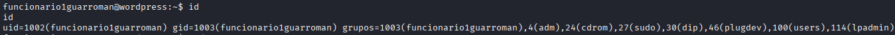
*(Captura 39: Verificación de pertenencia de funcionario1 al grupo sudo)*

<br>


*(Captura 40: Obtención de consola con privilegios root en el enrutador core JSBach de Guarromán)*

---

## 🎯 4. Campaña Ofensiva Final sobre Benimerda (DMZ Operativa)

### 📌 Contexto

Una vez completada la auditoría interna y demostrada la viabilidad de la cadena de ataque completa sobre la propia infraestructura, el equipo esperó a que la **DMZ web de Benimerda estuviese operativa**.

Cuando el portal WordPress del rival estuvo accesible, se replicaron las mismas técnicas de intrusión web empleadas contra Guarromán, esta vez con las credenciales obtenidas durante la fase OSINT.

<br>

### 🛠️ Pasos de Explotación en Benimerda

- **Acceso al Portal Web**: Se confirmó que la DMZ de Benimerda (`172.29.230.171`) servía un WordPress 4.7.29.
- **Autenticación con Credenciales OSINT**: Se accedió al panel `/wp-admin` con la cuenta `funcionario1benimerda` (Germán Tortosa), cuya contraseña fue obtenida durante la filtración de Gemini.
- **Inyección de Acceso Remoto**: Se instaló el plugin *File Manager* e inyectó el script PHP de Reverse Shell, replicando la misma técnica utilizada contra Guarromán.


*(Captura 41: Portal institucional del Ayuntamiento de Benimerda ("BENIMERDA") ya operativo en 172.29.230.171)*

<br>


*(Captura 42: Formulario de inicio de sesión en el WordPress de Benimerda)*

<br>

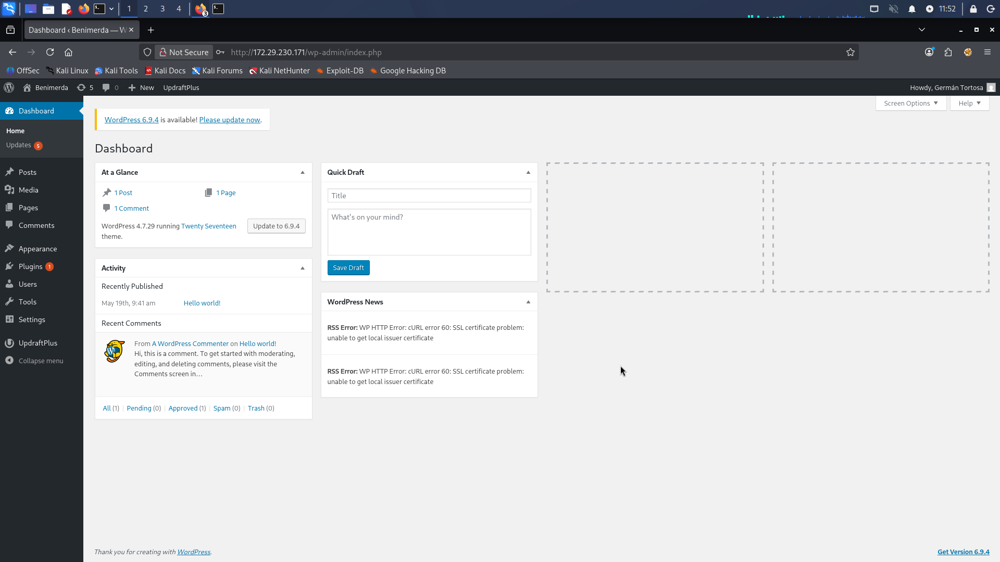
*(Captura 43: Acceso administrativo al dashboard de WordPress de Benimerda, logueado como "Germán Tortosa" con credenciales OSINT)*

<br>

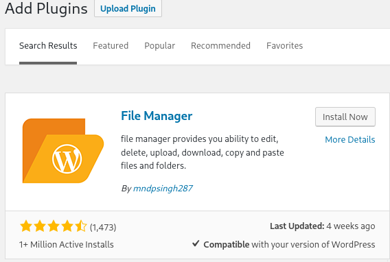
*(Captura 44: Instalación del plugin File Manager e inyección del script de acceso remoto en el WordPress del rival)*

---

## 🛡️ 5. Contramedidas y Protecciones Aplicadas en Active Directory

Tras finalizar la fase ofensiva, el Blue Team aplicó contramedidas de refuerzo (*hardening*) en las políticas del Active Directory de Guarromán para mitigar los vectores de ataque descubiertos:

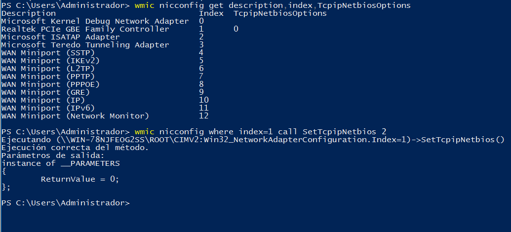
*(Captura 45: Aplicación de GPO para deshabilitar NetBIOS sobre TCP/IP)*

<br>

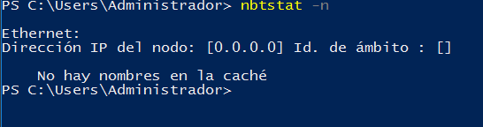
*(Captura 46: Verificación en terminal confirmando que NetBIOS ha quedado desactivado)*

<br>

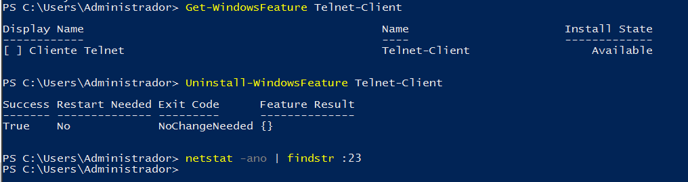
*(Captura 47: Verificación del servicio Telnet deshabilitado en todos los equipos del dominio)*

<br>

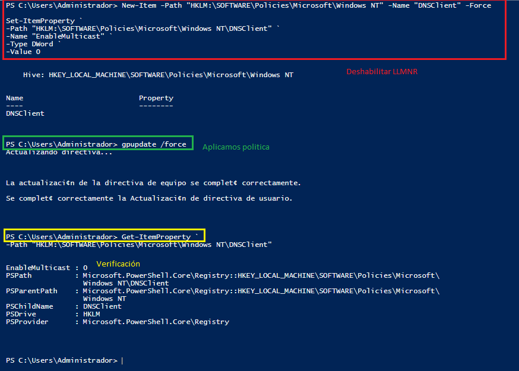
*(Captura 48: Desactivación de la resolución de nombres por LLMNR para evitar envenenamientos de red)*

---

## 📊 6. Matriz de Hallazgos y Vulnerabilidades

A continuación se sintetiza la matriz de vulnerabilidades identificadas durante la auditoría ofensiva, clasificadas según el estándar CVSS v3.1:

| ID | Hallazgo / Vulnerabilidad | Severidad | CVSS | Vector Principal | Remediación Recomendada |
| :---: | :--- | :---: | :---: | :--- | :--- |
| **H1** | Panel Zabbix con Credenciales por Defecto | CRÍTICA | **9.9** | `Admin / zabbix` expuesto | Cambiar contraseña por defecto y restringir acceso al SOC |
| **H2** | Panel phpMyAdmin Sin Restricciones en DMZ | CRÍTICA | **9.9** | Exposición pública | Desinstalar phpMyAdmin o limitar acceso por IP en la VLAN 1 |
| **H3** | Contraseñas en Texto Plano en WordPress | CRÍTICA | **9.9** | Tabla `wp_pass` expuesta | Eliminar tablas personalizadas sin hash y forzar uso de bcrypt/Argon2 |
| **H4** | Plugin *File Manager* Vulnerable a RCE | CRÍTICA | **9.9** | Subida de archivo `.php` dañino | Añadir `DISALLOW_FILE_EDIT=true` en `wp-config.php` y borrar plugin |
| **H5** | Reutilización de Credenciales Inter-Servicio | CRÍTICA | **9.9** | Clave `funcionario1` compartida | Aplicar contraseñas únicas por servicio mediante gestor de claves |
| **H6** | Regla Sudoers Permisiva (`NOPASSWD: ALL`) | CRÍTICA | **9.9** | Privilegios de `funcionario1` | Aplicar principio de menor privilegio en `/etc/sudoers` |
| **H7** | Credenciales por Defecto en Router JSBach | CRÍTICA | **9.9** | Acceso `admin / admin` | Cambiar credenciales, forzar HTTPS y restringir gestión SSH/HTTP |
| **H8** | Ausencia de Filtrado Inter-VLAN | ALTA | **8.5** | Salto libre entre equipos internos | Desplegar reglas de `iptables` estrictamente entre VLANs |
| **H9** | Versión de Apache Desactualizada | ALTA | **7.5** | Apache 2.4.58 conocido | Actualizar paquete `apache2` e implementar ModSecurity WAF |
| **H10** | Hashes Bcrypt Débiles en `wp_users` | MEDIA | **6.0** | Ataque offline de diccionario | Exigir contraseñas complejas de 12+ caracteres |
| **H11** | Filtración de Datos por Uso de Correo Personal | CRÍTICA | **9.5** | Reenvío de contraseñas prototipo | Prohibir el uso de cuentas privadas para gestión corporativa |
| **H12** | Filtración de Datos en IA Generativa Pública | CRÍTICA | **9.8** | Historial de Gemini expuesto | Bloquear acceso corporativo a IAs públicas no empresariales |

---

## 🛠️ 7. Plan de Remediación Priorizado

* **Acciones Inmediatas (24h)**: Cambio de credenciales por defecto en JSBach y Zabbix, eliminación de la tabla vulnerable `wp_pass`, desactivación del plugin *File Manager* y corrección de permisos en `/etc/sudoers`.
* **Fase Corto Plazo (1 Semana)**: Restricción de acceso a phpMyAdmin por IP, aplicación de políticas de contraseñas robustas en Active Directory y aislamiento inter-VLAN mediante `iptables`.
* **Fase Medio Plazo (1 Mes)**: Actualización de servicios web, activación de ModSecurity WAF y despliegue de doble factor de autenticación (2FA).
