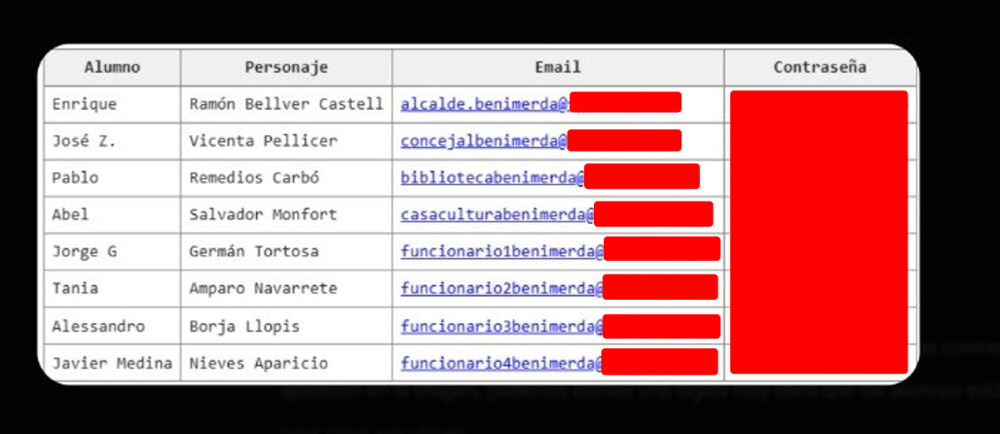

# 04. Operaciones Red Team y Auditoría Ofensiva (Pentesting)

> 👉 Para consultar el desglose exacto de tareas técnicas realizadas por cada miembro, revisa el **[Registro de Contribuyentes](../CONTRIBUTORS.md)**.<br>
> **Periodo**: Abril 2026 - Mayo 2026

## Descripción General

El equipo de Red Team ejecutó una auditoría de seguridad ofensiva simulando la perspectiva de un atacante externo sofisticado. El objetivo estratégico consistió en evaluar la postura defensiva del Ayuntamiento, identificar vulnerabilidades explotables en los activos expuestos y medir la capacidad de pivotaje hasta alcanzar el compromiso total de la infraestructura crítica.

Las operaciones se articularon en dos fases complementarias: inteligencia de fuentes abiertas (OSINT) y la posterior ventana de intrusión e ingeniería inversa sobre los servicios en producción.

---

## 🔎 1. Inteligencia de Fuentes Abiertas (OSINT)

* **Investigadores**: **Carlos Delgado**, **Pau Roig** y **Jorge Cortés**.
* **Objetivos**: Mapeo de la superficie expuesta y recopilación de huella digital técnica y organizativa del entorno rival (Ayuntamiento de Benimerda).

### 👥 Asignación de Perfiles Ficticios

Para simular un entorno corporativo realista sujeto a ataques de *spear-phishing* o ingeniería social, se asignaron identidades ficticias vinculadas a direcciones de correo del laboratorio:

| Cargo | Identidad Ficticia | Integrante Asignado |
| :--- | :--- | :--- |
| **Alcalde** | Baltasar Cañete Huertas | Carlos Delgado |
| **Concejala** | Rocío Mesa Jiménez | Pau Roig |
| **Biblioteca** | Dolores Expósito | Enrique Cebrián |
| **Representante Casa Cultura** | Fermín Valverde | Alfonso Garrido |
| **Funcionario / Informático** | Isidoro Quesada | Jose Luis Oliver |
| **Otros Funcionarios** | Trinidad Molina / Cristóbal Lorite / Valvanera Pinilla | Luis Fuster / Jorge Cortés / Marcos Bori |

### 🛠️ Vectores de Reconocimiento y Auditoría Defensiva
- **Enumeración de Dominios e IPs**: Identificación de rangos de direccionamiento público y puntos de entrada expuestos.
- **Filtro de Credenciales Filtradas**: Búsqueda pasiva en bases de datos de brechas de terceros (ej. *HaveIBeenPwned*), identificando patrones de contraseñas débiles reutilizadas por perfiles administrativos.
- **Autoprotección (Blue OSINT)**: Carlos Delgado auditó los correos del Ayuntamiento de Guarromán para mitigar la enumeración de usuarios en el CMS WordPress y solicitar el borrado de huellas en plataformas de acceso público.

### 🏆 Compromiso Total de Credenciales (Vía Filtración IA)

A través de las investigaciones de OSINT, entre el 4 y el 9 de mayo, el equipo logró vulnerar de forma secuencial las cuentas del ayuntamiento rival (Benimerda):

1. **4 de mayo**: Se obtuvo la contraseña de la Concejala de Benimerda mediante técnicas OSINT directas.
2. **5 de mayo (Hallazgo Clave)**: Se consiguieron las credenciales de *Funcionario 2* (fuerza bruta con diccionario personalizado) y *Funcionario 5*. Al acceder a una de estas cuentas, se descubrió un **correo electrónico reenviado desde una cuenta personal** que contenía una tabla con contraseñas "prototipo" o parciales de todos los miembros del equipo.
3. **5 al 9 de mayo (Compromiso Crítico)**: Gracias a los patrones descubiertos en el correo filtrado, se logró deducir y vulnerar la contraseña de la cuenta del **Alcalde de Benimerda**. Al investigar su historial, se descubrió una conversación filtrada con la inteligencia artificial *Gemini*, donde el Alcalde había expuesto **las contraseñas definitivas en texto plano de absolutamente todo su equipo**.

Este hallazgo permitió la recolección total de las credenciales del equipo contrario, demostrando dos riesgos críticos: el reenvío de credenciales a cuentas personales y la fuga de datos (*Data Leak*) en plataformas de IA generativa.

**Evidencias de la filtración:**

> *Captura 1: Correo interceptado con contraseñas "prototipo" reenviado desde cuenta personal.*


> *Captura 2: Repositorio final con todas las credenciales definitivas obtenidas de Gemini.*



> *Captura 3: Historial filtrado de Gemini en la cuenta del Alcalde.*


> *Captura 4: Sesiones de correo vulneradas demostrando acceso total al equipo de Benimerda.*


---

## ⚔️ 2. Cadena de Ataque (Attack Chain)

La intrusión ofensiva sobre la DMZ culminó con la toma de control del router principal (JSBach) en una ventana de **~4 horas**:

```
[ phpMyAdmin Expuesto ] ➔ [ Fuerza Bruta / Diccionario OSINT ] ➔ [ Hash/Texto Plano wp_users ]
                                                                             │
[ ROOT JSBACH (Control Total) ] ◄─ [ Escalada Sudoers ] ◄─ [ Reverse Shell (RCE) ] ◄─┘
```

1. **Reconocimiento y Descubrimiento**: Escaneo pasivo y activo sobre la DMZ (`10.x.2.10`). Descubrimiento del panel de gestión `phpMyAdmin` expuesto sin restricciones de IP ni filtrado WAF.
2. **Acceso Inicial (Initial Access)**: Ataque de fuerza bruta mediante diccionarios generados en la fase de OSINT. Obtención de credenciales de superusuario de base de datos (`root` / `alumno`).
3. **Escalada a Nivel de Aplicación**: Inspección de la base de datos `wp_db`. Extracción de credenciales de la tabla `wp_users`, permitiendo el acceso administrativo al panel de WordPress (`/wp-admin`).
4. **Ejecución de Código Remoto (RCE)**: Inyección de una *Reverse Shell* en PHP a través del plugin *File Manager* y modificación de plantillas del tema activo, devolviendo una consola interactiva como usuario de servicio `www-data`.
5. **Movimiento Lateral y Escalada de Privilegios**: Explotación de la directiva `ALL=(ALL) NOPASSWD: ALL` en el archivo `/etc/sudoers` del usuario local `funcionario1guarroman`, obteniendo sesión interactiva como `root` en el router de frontera JSBach.

---

## 📊 3. Matriz de Hallazgos y Vulnerabilidades

A continuación se detalla la matriz de vulnerabilidades identificadas durante la auditoría ofensiva, clasificadas según el estándar CVSS v3.1:

| ID | Hallazgo / Vulnerabilidad | Severidad | CVSS | Vector Principal | Remediación Recomendada |
| :---: | :--- | :---: | :---: | :--- | :--- |
| **H1** | Panel Zabbix con Credenciales por Defecto | CRÍTICA | **9.9** | `Admin / zabbix` expuesto | Cambiar contraseña por defecto y restringir acceso al SOC |
| **H2** | Panel phpMyAdmin Sin Restricciones en DMZ | CRÍTICA | **9.9** | Exposición pública | Desinstalar phpMyAdmin o limitar acceso por IP en la VLAN 1 |
| **H3** | Contraseñas en Texto Plano en WordPress | CRÍTICA | **9.9** | Tabla `wp_pass` expuesta | Eliminar tablas personalizadas sin hash y forzar uso de bcrypt/Argon2 |
| **H4** | Plugin *File Manager* Vulnerable a RCE | CRÍTICA | **9.9** | Subida de `.php` malicioso | Añadir `DISALLOW_FILE_EDIT=true` en `wp-config.php` y borrar plugin |
| **H5** | Reutilización de Credenciales Inter-Servicio | CRÍTICA | **9.9** | Clave `funcionario1` compartida | Aplicar contraseñas únicas por servicio mediante gestor de claves |
| **H6** | Regla Sudoers Permisiva (`NOPASSWD: ALL`) | CRÍTICA | **9.9** | Privilegios de `funcionario1` | Aplicar principio de menor privilegio en `/etc/sudoers` |
| **H7** | Credenciales por Defecto en Router JSBach | CRÍTICA | **9.9** | Acceso `admin / admin` | Cambiar credenciales, forzar HTTPS y restringir gestión SSH/HTTP |
| **H8** | Ausencia de Filtrado Inter-VLAN | ALTA | **8.5** | Movimiento lateral libre | Desplegar reglas de `iptables` estrictas entre VLANs |
| **H9** | Versión de Apache Desactualizada | ALTA | **7.5** | Apache 2.4.58 conocido | Actualizar paquete `apache2` e implementar ModSecurity WAF |
| **H10** | Hashes Bcrypt Débiles en `wp_users` | MEDIA | **6.0** | Ataque offline de diccionario | Exigir contraseñas complejas de 12+ caracteres |
| **H11** | Fuga de Datos por Uso de Correo Personal | CRÍTICA | **9.5** | Reenvío de contraseñas prototipo | Prohibir el uso de cuentas privadas para gestión corporativa |
| **H12** | Fuga de Datos en IA Generativa Pública | CRÍTICA | **9.8** | Historial de Gemini expuesto | Bloquear acceso corporativo a IAs públicas no empresariales |

---

## 🛠️ 4. Plan de Remediación Priorizado

* **Acciones Inmediatas (24h)**: Cambio de credenciales por defecto en JSBach y Zabbix, eliminación de la tabla vulnerable `wp_pass`, desactivación del plugin *File Manager* y corrección de permisos en `/etc/sudoers`.
* **Fase Corto Plazo (1 Semana)**: Restricción de acceso a phpMyAdmin por IP, aplicación de políticas de contraseñas robustas en Active Directory y aislamiento inter-VLAN mediante `iptables`.
* **Fase Medio Plazo (1 Mes)**: Actualización de servicios web, activación de ModSecurity WAF y despliegue de doble factor de autenticación (2FA).
