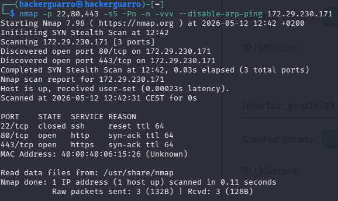
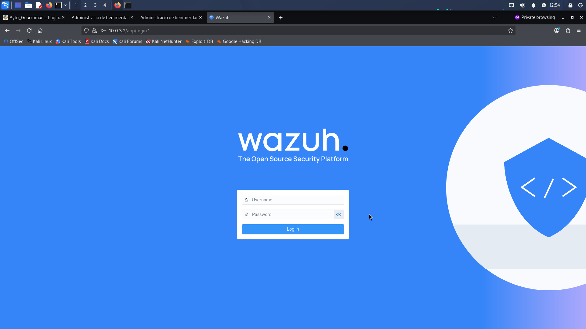
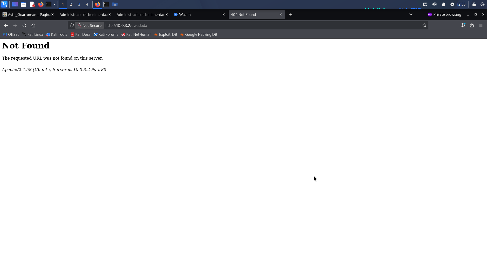
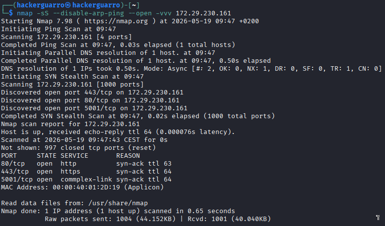
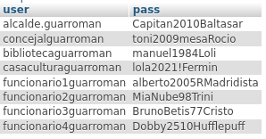
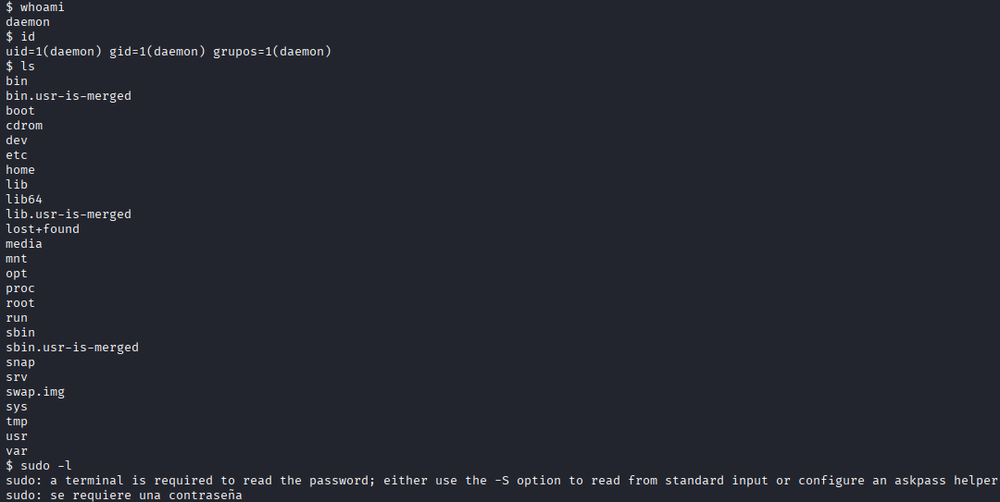
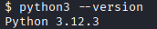
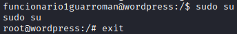
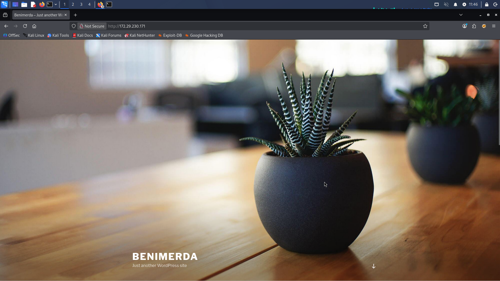

# 11. Informe Operacional Red Team (Bitácora Detallada)

> **Participantes**: Carlos Delgado, Pau Roig, Jose Luis Oliver
> **Periodo**: 19 - 21 de Mayo 2026
> **Clasificación**: INTERNO - Información Sensible

## Resumen Ejecutivo

Durante la operación de Red Team, se llevó a cabo un análisis completo de seguridad en dos entornos municipales: **Ayuntamiento de Guarroman** y **Ayuntamiento de Benimerda**. El objetivo fue identificar vulnerabilidades críticas en la infraestructura de red, aplicaciones web y sistemas de gestión.

### Objetivos Alcanzados:
- Acceso inicial obtenido a sistemas de Guarroman
- Escalada de privilegios a root completada
- Acceso a bases de datos MySQL (phpMyAdmin)
- Control de aplicaciones WordPress
- Descubrimiento de sistemas de monitorización no asegurados (Zabbix)
- Reconocimiento completo de infraestructura Benimerda

### Riesgos Identificados:
| Riesgo | Severidad | Estado |
|--------|-----------|--------|
| Credenciales por defecto en Zabbix | Crítica | Confirmado |
| phpMyAdmin expuesto públicamente | Crítica | Explotado |
| Contraseñas en texto plano en BD | Crítica | Confirmado |
| Plugin File Manager vulnerable | Crítica | Explotado |
| Permisos sudo incorrectos | Crítica | Confirmado |

---

## Fase 1: Reconocimiento Inicial - Benimerda

### 1.1 Identificación de Objetivos

Para realizar el ataque, primero es necesario identificar a la víctima. El equipo de Red Team inicia con un escaneo de la red en busca de posibles direcciones IP del objetivo.

**Información de Contexto:**
- **Red Guarroman:** `172.29.230.160/25` y `172.29.230.161/25`
- **Red Benimerda:** `172.29.230.170/25` y `172.29.230.171/25`

### 1.2 Escaneo Netdiscover - Descubrimiento de Hosts

Aunque ya se conoce la IP de antemano, esta primera fase de reconocimiento es fundamental. Se obtiene no solo la dirección IP, sino también la dirección MAC que puede ser relevante para futuros ataques.


### 1.3 Escaneo Nmap Profundo - Benimerda (172.29.230.171/25)

Una vez identificados los objetivos, se procede con un escaneo más en profundidad utilizando nmap con opciones de scripts y detección de versiones:

```bash
nmap -p 22,80,443 -sS -sC -sV --disable-arp-ping -vvv --open --min-rate 5000 172.29.230.171
```

**Resultado del Escaneo:**



### 1.4 Acceso al Dispositivo JSBach - Primer Vector de Ataque

Se accede a la IP por el puerto 443 utilizando HTTPS. Se intenta acceso al panel administrativo del dispositivo JSBach.

**URL de acceso:** `https://172.29.230.171:443`


**Resultado:** Se logra acceso con credenciales por defecto `admin:admin`


**Lección:** Los routers con credenciales por defecto son un punto de entrada crítico para la red completa.

### 1.5 Exploración del Router - Extracción de Información Crítica

Se explora la interfaz del router para extraer información sobre la configuración de red, especialmente la estructura de VLANs.

**Configuración de DHCP y VLANs encontradas:**


### 1.6 Configuración de Rutas de Enrutamiento - Acceso a VLANs (Pivoting)

Con la información sobre las VLANs, se modifica la tabla de enrutamiento de nuestro equipo para obtener acceso a toda la infraestructura de red de Benimerda. Esta técnica se conoce como **pivoting**.

**Paso 1 - Ruta inicial hacia el router (172.29.230.171):**

```bash
sudo ip r a 10.0.0.0/8 via 172.29.230.171
```


**Problema encontrado:** Sin acceso aún a todas las VLANs.

Se descubre que existe una segunda IP (`172.29.230.170`) que también proporciona acceso a otras VLANs, incluyendo la VLAN 99 (backups).


**Paso 2 - Rutas adicionales hacia ambos routers:**

```bash
sudo ip r a 10.0.0.0/16 via 172.29.230.170
sudo ip r a 10.1.0.0/16 via 172.29.230.171
```


**Resultado:** Acceso completo a toda la infraestructura de VLANs de Benimerda.

**Técnica:** Network pivoting mediante modificación de rutas permite acceso lateral a subredes protegidas.

---

## Fase 2: Reconocimiento de Infraestructura Crítica

### 2.1 Exploración de VLANs del SOC

Se localiza la infraestructura del SOC en la VLAN `10.0.3.0/24`. Se descubre la IP del Wazuh: `10.0.3.2`


Se accede al panel de login del Wazuh:



Se observa la versión de Apache expuesta: **2.4.58**



**Análisis de Vulnerabilidades:**
- Posibles ataques DoS para Apache 2.4.58
- Reutilización de credenciales OSINT - Sin éxito
- Se requieren las credenciales de instalación por defecto (desconocidas)

**Resultado:** Sin acceso directo. Movimiento lateral hacia otras VLANs.

### 2.2 Descubrimiento del Directorio Activo (AD) y Odoo

Se localiza el AD por servicios típicos (Kerberos, LDAP). Se identifica Odoo instalado en el equipo del AD.


Se logra acceso a Odoo reutilizando credenciales del usuario `funcionario1`:


**Información extraída:**
- Lista de empleados y usuarios del sistema
- Estructura organizacional
- Posibles usuarios para posteriores ataques

### 2.3 Descubrimiento de Zabbix - Sistema de Monitorización No Asegurado

Se ejecuta gobuster en el SOC para descubrir directorios ocultos. Se encuentra un puerto 80 abierto adicional con **Zabbix**, un sistema de monitorización empresarial.

**Comando ejecutado:**

```bash
gobuster dir -u http://10.0.3.2/ --wordlist /usr/share/wordlists/dirbuster-wordlist/directory-list-2.3-medium.txt
```


**Acceso a Zabbix:**


**Investigación de Credenciales por Defecto:**

Se buscan las credenciales por defecto de Zabbix (usuario: `Admin`, contraseña: `zabbix`):


**¡ACCESO EXITOSO!**


**Información Extraída:**
- Observación: JSBach del ayuntamiento registrado con IP `10.0.1.1`
- Actualmente inaccesible desde Zabbix
- Mínima información disponible sobre el equipo

**Lecciones Aprendidas:**
1. Credenciales por defecto nunca se deben usar en producción
2. Los sistemas de monitorización contienen información muy sensible
3. Reutilización de credenciales comunes es un riesgo crítico

---

## Fase 3: Análisis de Vectores Fallidos en Benimerda

Se intenta continuar la explotación en Benimerda, pero se encuentran varios obstáculos.

### 3.1 Router JSBach - Bastionado Correctamente

**Intentos de Explotación:**
- Path traversal en campo de configuración de VPN
- Ataques XSS en interfaces web
- Exploración de credenciales VPN

**Resultado:** Sistemas bien configurados para bloquear estos vectores. El router está correctamente bastionado.

### 3.2 SOC (Wazuh) - Credenciales Desconocidas

- Credenciales de OSINT no funcionan
- No se tienen credenciales de instalación por defecto
- Puerto 22 expuesto pero autenticación fuerte
- Sin éxito con ataques de fuerza bruta

**Resultado:** Acceso bloqueado por autenticación robusta.

### 3.3 Equipo de Backups (10.0.99.2) - Acceso Restringido

- Solo acepta autenticación por pares de claves SSH (sin contraseña)
- Las claves probablemente están en SOC o JSBach (ambos descartados)

**Resultado:** Escalada de privilegios imposible con vectores actuales.

### 3.4 DMZ - No Disponible

- La infraestructura de Benimerda está incompleta
- No hay suficientes vectores de ataque alternativos
- Riesgo de interrupción del servicio (MiTM en Gateway no viable)

### Conclusión Benimerda

**Objetivo bastionado correctamente.** La operación se enfoca en **Ayuntamiento de Guarroman** como objetivo principal.

---

## Fase 4: Reconocimiento - Ayuntamiento de Guarroman

### 4.1 Escaneo de Subred

Se realiza un escaneo de la subred de Guarroman para identificar objetivos:

```bash
nmap 172.29.230.128/25
```

**Hosts identificados:** `172.29.230.160` y `172.29.230.161`

### 4.2 Escaneo Nmap Específico - 172.29.230.161

```
Nmap scan report for 172.29.230.161
Host is up (0.00062s latency).
Not shown: 997 closed tcp ports (conn-refused)
PORT     STATE SERVICE
80/tcp   open  http
443/tcp  open  https
5001/tcp open  commplex-link
```



### 4.3 Escaneo Profundo - Detección de Servicios

**Comando ejecutado:**

```bash
nmap -sC -sV -p 80,443,5001 --open -vvv -oX ports.xml 172.29.230.161
xsltproc ports.xml -o ports.html
```


**Servicios Detectados:**

```
PORT     STATE SERVICE        REASON  VERSION
80/tcp   open  http           syn-ack Apache httpd
         · WordPress 4.7.33
         · URL: http://172.29.230.161/webguarroman/
443/tcp  open  http           syn-ack Apache httpd 2.4.58 (Ubuntu)
         · 403 Forbidden
5001/tcp open  commplex-link  syn-ack Werkzeug/3.0.1 Python/3.12.3
```


### 4.4 Sitio Web - Página Principal

Se accede a la página principal del ayuntamiento en: `http://172.29.230.161/webguarroman/`


### 4.5 Enumeración de Directorios - Gobuster

Se ejecuta gobuster para encontrar directorios ocultos:

```bash
gobuster dir -u http://172.29.230.161/ \
  --wordlist /usr/share/wordlist/dirbuster-wordlist/directory-list-2.3-medium.txt \
  --exclude-length 954
```

**Resultado:**

```
/phpmyadmin           (Status: 301) [Size: 241]
Progress: 220560 / 220561 (100.00%)
```

**Vulnerabilidad crítica encontrada:** phpMyAdmin expuesto públicamente

---

## Fase 5: Acceso Inicial - phpMyAdmin

### 5.1 Panel de Login phpMyAdmin

Se accede a phpMyAdmin en: `http://172.29.230.161/phpmyadmin`


### 5.2 Reutilización de Credenciales OSINT

Se obtienen credenciales de OSINT del equipo de Benimerda. Se prueba con múltiples usuarios.

**Cuentas NO proporcionadas:**
- `concejal.guarroman`
- `funcionario1guarroman`
- `funcionario4guarroman`

**Intento Exitoso:**
- **Usuario:** `funcionario2guarroman`
- **Contraseña:** `MiaNube98Trini`

**Resultado:** Acceso ganado, pero solo con permisos de lectura (no administrador).

### 5.3 Exploración de Base de Datos - Tabla wp_users

Se encuentra la tabla `wp_users` con hashes de contraseñas:


**Análisis:** Los hashes están cifrados con bcrypt. Poco probable de romper sin diccionario específico.

### 5.4 Descubrimiento Crítico - Tabla wp_pass

**HALLAZGO CRÍTICO:** Se localiza tabla `wp_pass` con **contraseñas en texto plano**:



**Credenciales obtenidas y validadas:** Se prueban con WordPress
- **Usuario:** `funcionario1guarroman`
- **Contraseña:** [extraída de wp_pass]

**Acceso exitoso a WordPress**

---

## Fase 6: Acceso a WordPress - Instalación de Plugin Malicioso

### 6.1 Autenticación en WordPress

Se accede a `http://172.29.230.161/webguarroman/login.php` con credenciales válidas del archivo wp_pass.

### 6.2 Instalación del Plugin File Manager

Se instala el plugin vulnerable **"File Manager"** que permite:
- Navegación completa por el sistema de archivos
- Subida y descarga de archivos
- Modificación de permisos de archivos
- Ejecución de código PHP


### 6.3 Preparación de Reverse Shell

Se prepara una reverse shell para obtener acceso remoto al servidor. Se utiliza el plugin File Manager para subir el archivo malicioso.


**Estrategia:** Cuando un usuario acceda a `http://172.29.230.161/index.php`, se ejecutará automáticamente la reverse shell.

---

## Fase 7: Shell Remota - Acceso al Servidor

### 7.1 Listener Netcat

Se prepara un listener en el puerto 1234 en la máquina atacante:

```bash
nc -lvnp 1234
```

### 7.2 Ejecución de la Reverse Shell

Se accede a `http://172.29.230.161/index.php` desde navegador. Se ejecuta la payload.


**¡Conexión exitosa!**

### 7.3 Información Inicial de la Sesión

Se obtiene acceso remoto con usuario `daemon`:



### 7.4 Mejora de la Shell - Python a Bash Interactivo

Se detecta Python 3.12.3 instalado (coincide con escaneo nmap):



Se utiliza Python para obtener una bash interactiva (mucho más estable que sh):


**Shell estable conseguida:** Ahora se pueden ejecutar comandos de forma interactiva.

---

## Fase 8: Escalada de Privilegios

### 8.1 Intento 1 - linPEAS (Privilege Escalation Awesome Script)

Se descarga y ejecuta linPEAS para identificar posibles vectores de escalada de privilegios:

**Referencia:** [PEASS-ng/linPEAS](https://github.com/peass-ng/PEASS-ng/tree/master/linPEAS)


**Resultado:** No se logran permisos suficientes para ejecutar linPEAS correctamente.

### 8.2 Intento 2 - CVE CopyFail (732 Bytes to Root)

Se intenta explotar CopyFail, una vulnerabilidad en todos los sistemas Linux desde 2017 que explota la paginación de la memoria.

**Referencia:** [Copy Fail — 732 Bytes to Root](https://copy.fail/#exploit)


**Resultado:** CopyFail no funciona en este sistema.

### 8.3 Intento 3 - Reutilización de Credenciales Locales

Se examina el archivo `/etc/passwd` para identificar usuarios locales:


**Hallazgo:** Existe el usuario `funcionario1guarroman` en el sistema local.

**Hipótesis:** Pueden haber reutilizado la contraseña de WordPress para el usuario local.

Se intenta cambiar al usuario `funcionario1guarroman` reutilizando su contraseña de WordPress:

```bash
su - funcionario1guarroman
```


**¡ÉXITO!** La contraseña funciona.

### 8.4 Escalada a ROOT - Verificación de Permisos

Se ejecuta el comando para escalar a root:

```bash
sudo su -
```



**ACCESO ROOT COMPLETADO**

```
uid=0(root) gid=0(root) groups=0(root)
```

---

## Fase 9: Post-Explotación - Ayuntamiento de Guarroman

En este punto, se tiene control total del servidor con acceso root. Se podrían ejecutar acciones como:

- Lectura de archivos sensibles
- Modificación de datos
- Instalación de puertas traseras (backdoors)
- Robo de credenciales
- Movimiento lateral hacia otros sistemas
- Borramiento de logs

**Para esta operación de Red Team, se detiene aquí para demostrar el impacto sin causar daño permanente.**

---

## Fase 10: Reconocimiento Adicional - Benimerda (Segundo Intento)

### 10.1 Escaneo Nmap de Benimerda

Se realiza un escaneo final de la infraestructura de Benimerda:

```bash
nmap -sC -sV -p 22,80,443 -sS --open -vvv --disable-arp-ping 172.29.230.171
```



### 10.2 Acceso a WordPress de Benimerda

Se accede al sitio WordPress de Benimerda:


**Intento de acceso:** Se reutilizan credenciales OSINT del usuario `funcionario1`:

Las credenciales de `funcionario1` fueron obtenidas por el equipo de Red Team (Guarroman) a través de análisis OSINT sobre la infraestructura de Benimerda.


**Acceso exitoso** - La reutilización de credenciales OSINT funcionó nuevamente

### 10.3 Instalación del Plugin File Manager

Se procede a instalar el plugin de File Manager en WordPress de Benimerda (mismo vector que en Guarroman):


**Nota:** En una operación real, se continuaría con la subida de reverse shell y explotación completa.

---

## Resumen de Vulnerabilidades Identificadas

| ID | Vulnerabilidad | Severidad | Impacto | Estado |
|----|---|---|---|---|
| 1 | Credenciales por defecto en Zabbix | Crítica | Acceso a info. sensible | Confirmado |
| 2 | phpMyAdmin expuesto públicamente | Crítica | Acceso a BD completa | Explotado |
| 3 | Contraseñas en texto plano (wp_pass) | Crítica | Acceso a aplicaciones | Explotado |
| 4 | Plugin File Manager vulnerable | Crítica | RCE - Ejecución de código | Explotado |
| 5 | Reutilización de contraseñas | Crítica | Escalada de privilegios | Confirmado |
| 6 | Permisos sudoers sin contraseña | Crítica | Acceso root | Confirmado |
| 7 | Router JSBach con credenciales por defecto | Crítica | Acceso a red interna | Confirmado |

---

## Recomendaciones de Mitigación

### Inmediatas (Semana 1):
1. Cambiar TODAS las credenciales por defecto (Zabbix, routers, servidores)
2. Desactivar phpMyAdmin o restringir acceso por IP
3. Eliminar tabla wp_pass o cifrar contraseñas
4. Eliminar plugin File Manager vulnerable
5. Aplicar principio de menor privilegio (revisar sudoers)

### Corto Plazo (Mes 1):
6. Implementar WAF (Web Application Firewall)
7. Configurar IDS/IPS en red perimetral
8. Auditoría de permisos en todos los sistemas
9. Implementar MFA en accesos administrativos
10. Realizar escaneo de vulnerabilidades mensual

### Largo Plazo (Trimestral):
11. Implementar Zero Trust Network Architecture
12. Segmentación de red por VLAN con firewall
13. Plan de respuesta a incidentes
14. Programa de concienciación de seguridad
15. Penetration testing trimestral

---

## Línea de Tiempo Operacional

| Tiempo | Evento | Resultado |
|--------|--------|-----------|
| T+0 | Escaneo Netdiscover | Hosts identificados |
| T+15min | Acceso JSBach admin:admin | Credenciales por defecto |
| T+30min | Configuración rutas VLANs | Acceso a red interna |
| T+1h | Descubrimiento Zabbix | Sistema no asegurado |
| T+1.5h | Gobuster - descubrimiento phpmyadmin | Acceso a BD |
| T+2h | Obtención credenciales wp_pass | Acceso WordPress |
| T+2.5h | Instalación File Manager | Upload de reverse shell |
| T+3h | Shell remota obtenida | Usuario: www-data |
| T+3.5h | Cambio a funcionario1guarroman | Permisos sudo verificados |
| T+4h | Escalada a ROOT | Control total del sistema |

---

## Conclusión

La operación de Red Team ha identificado vulnerabilidades críticas que permiten acceso completo a los sistemas de ambos ayuntamientos. El camino de explotación más viable fue:

```
Credenciales por defecto JSBach
    ↓
Configuración de VLANs y rutas
    ↓
Descubrimiento de phpMyAdmin
    ↓
Extracción de contraseñas (wp_pass)
    ↓
Acceso WordPress
    ↓
Plugin vulnerable File Manager
    ↓
Reverse Shell
    ↓
Escalada de privilegios (sudoers)
    ↓
ROOT ACCESS
```

**Tiempo total de explotación:** ~4 horas
**Nivel de dificultad:** Moderado
**Impacto:** Crítico - Control total de sistemas
